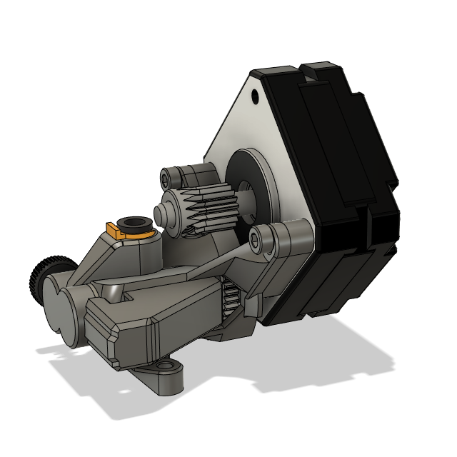

# Superfly Extruder
### A Compact BMG Conversion

** *Update (10th May 2021) - Added a higher strength tensioner, more suitable for high-speed printing, see details in "Printed Parts"*

The Superfly is a compact extruder designed to reuse the excellent dual drive gears of the beloved BMG extruder.
As with the BMG, the Superfly is a dual-drive geared extruder with a 3:1 gear ratio. It is designed with the following characteristics in mind:
- compact and lightweight
- short filament path
- balanced center of gravity
- easy to source hardware
- support both NEMA 17 and round NEMA 14 motors
- easy to print

Here are some pictures so that you can get a good idea of what the Superfly looks like:

The weight of the printed parts for the Superfly comes in at less than 11 gram, a true Flyweight class!
The following shows the weight of a Superfly printed at 0.2mm layer height in PLA+ with 4 walls and plently of infill:

For reference, the weight of the printed parts is almost exactly the same as the Sherpa Mini with the same slicer settings:

Fully assembled without motors, the Superfly comes in at around 30-31 gram.

## Parts
You will need the following parts of your BMG:
- the **drive shaft** with the large plastic gear attached
- the **drive gear**, this is the gear that is on the drive shaft
- the **idler gear**, its shaft, and the two needle bearings inside, these are the parts that were on the BMG's tension arm
- **2 x MR85 bearings** that the drive shaft runs on
- **Thumbscrew** and **spring** (the washer is optional)
- the **motor gear**, if you're planning on using a motor without a gear pre-installed

These parts can be removed without any damage to the BMG, so you can reassembled the BMG later on if you wish. If you don't already have a BMG, there are also stores that sell only these internal parts, which should be cheaper than buying a new BMG only to salvage its innards.

In addition to the BMG parts, you will also need the following hardware:
- an M3 nut for securing the thumbscrew
- 4 x M3 screws for mounting (6mm-12mm depending on your motor and mounting needs).

If you're going to be running a reverse-bowden, you'll also need:
- an embedded bowden collet (the type commonly used on a V6 heatsink)
- 4mm OD PTFE tubing

For the motor, as mentioned above, both NEMA 17 and the round NEMA 14 motors are supported. A scalable motor spacer is provided (see **The Motor Spacer** below) to help compensate for the differences in your motor's shaft length, so there's a good chance that you might already have a compatible motor on hand.

## Printed Parts
There are only 4 parts that you need to print:
- The **main housing** holds the drive gear assembly and one of the MR85 bearings.
- The **back housing** holds the other MR85 bearing and keep the drive gear assembly in the main housing.
- The **tensioner** holds the idler gear pressed to the drive gear with the tension from the spring and thumbscrew.
- The **tensioner_high-tension** is an alternate version of the tensioner that can provide stronger tension. The difference is that the regular tensioner has a hard-stop just before the gear pushes the filament in too deep to prevent over-tightening, while the high-tension version removes the stop and allow the thumbscrew to pull on the tensioner with more force. Please be aware that over-tightening the thumbscrew can damage the filament and/or your printed parts.  
- The **motor spacer**, see details below:

### The Motor Spacer
The motor spacer is an optional part designed to go between the main housing and the motor to allow you to use motors with shaft longer than 15mm. Any longer than 15mm, the shaft can hit the feeding hole where the PTFE tube collet is attached:

For example, if you're using a motor with 20mm shaft, you will need to scale the provided spacer to the thickness of around 4.5-5mm before printing.
Here's how the extruder looks with and without the spacer:

Additionally, some variations of the drive shaft are known to be a bit long and may protrude beyond MR85 bearing at the back:

If this is the case for your drive shaft, then you will need a spacer to make sure that the shaft is not pushing against the motor's body. Finally, if you are using a NEMA 14 motor and you prefer to save weight than adding a spacer, you can grind away the protruding portion of the drive shaft, this is commonly done on other similar round NEMA 14 based extruder like the Sherpa Mini. Here's how the extruder should looks with a round NEMA 14 motor:

## Printing Recommendations:
All parts are printable in under 3 hours and should be an easy print for most modern printers. The following are some recommendations to help increase your chance of success:
- The main housing should be printed "face down" as oriented in the STL, the model is designed to minimize supports in this orientation.
- Supports are only needed for the main housing where the two motor mount holes are. Other overhangs and bridges are very printable.
- Raft should be enabled for the main housing unless you're very confident in your bed-adhesion.
- The tensioner should be printed with plenty of walls and infill to make sure that it doesn't break under stress.
- As with most mechanical prints, your printer should be capable of producing parts with decent dimensional accuracy. If you found that your printed parts are too tight, try the "extra_clearance" version of the main housing instead.

## Post Print:
- Clean up holes with drills
- Check that all parts fit together. Sand if necessary.

## Assembly
Assembly is very straight forward. The following images should be a good enough guide for you to see how all the parts fit together:

Here is what your main housing should look like before and after assembly:

And here is what the tensioner should look like once assembled:

One thing to make sure of during assembly is that the drive gear line-up correctly with the filament path. This is best done by inserting a piece of filament as guide before tightening the drive gear fully. Once the drive gear is positioned correctly, when there is a filament moving in the slot, the idler gear will align itself to match the position of the drive gear. This is also true for most extruders with similar dual-drive systems.

## Finally,
I'll links to mounts and mods of the Superfly here when I'm informed of them. Hopefully there'll be some makers kind enough to early adopt the Superfly into their home soon :D

That is all! I hope you will enjoy using the Superfly as much as I enjoy creating it :)

Thank you.
